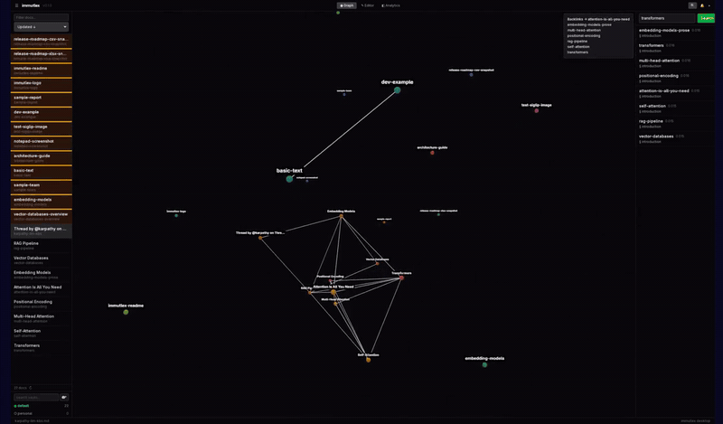

  

<h1 align="center">immutlex</h1>

  <strong>An immutable knowledge base your AI agent queries over MCP, instead of guessing.</strong>

  <a href="https://immutlex.dev">immutlex.dev</a> &nbsp;&middot;&nbsp;
  <a href="https://immutlex.dev/#see">See it work</a> &nbsp;&middot;&nbsp;
  <a href="https://immutlex.dev/#pricing">Pricing</a>

  
   
  <em>An agent's knowledge base, as a living graph it can search and traverse.</em>

---

immutlex is an immutable knowledge base for AI agents. You ingest documents (markdown with `[[wikilinks]]`, plus PDFs, CSVs, images, and any web page) and immutlex chunks, embeds, indexes, and links them into a navigable knowledge graph. Then it serves that graph back to your agent over MCP (tools across 13 categories) and to you over a CLI.

It runs entirely from local models in a single self-contained binary: no cloud, no API keys, no telemetry. Everything is plain markdown in S3-compatible storage you control.

> This repository is the public home for immutlex: docs, releases, and issues.
> immutlex is a paid, closed-source product. Get it at **[immutlex.dev](https://immutlex.dev)**.

## Why

Your agent can search the web but cannot build a persistent, cross-linked memory. It cannot remember what it read yesterday, connect ideas across documents, or find the one paragraph buried in a PDF from last week. The fix is not a bigger model, it is a substrate: the substrate is the working memory, the prompt is the question. You ask something short, and immutlex attaches the few highest-ranked chunks relevant to that question before the model ever reads the prompt. Token bills drop, recall stops being random, and confident-but-wrong answers go from common to rare.

## What it does

- **Immutable knowledge base.** Every document is a content-addressed revision with a full audit trail. Nothing is silently overwritten.
- **A real knowledge graph.** Documents are nodes; `[[wikilinks]]` are edges. Forward links come from the body, backlinks are generated, and semantic edges are inferred so related docs connect even without an explicit link.
- **Fused retrieval.** Semantic plus lexical search merged with reciprocal-rank fusion, plus heading search, backlink search, and graph operations (neighbors, shortest path, community detection, orphan detection).
- **Multimodal ingest.** Markdown, PDFs, CSVs, images, and any web page. Frontmatter is auto-generated from the filename and body links when missing.
- **Runs local.** Embedding and OCR models run inside the binary: no download step, no network call at inference time.
- **Storage you own.** One S3-compatible connection string: the bundled local object store, your own S3 bucket, or your Azure ADLS.
- **Cognitive maintenance.** Scheduled jobs decay stale relevance, stitch orphaned docs back into the graph, and keep the knowledge base sharp over months instead of letting it bloat.

## Interfaces

- **MCP server** over stdio for local agents, or HTTP for remote agents. Any MCP-speaking agent (Claude, Codex, Copilot, Cursor) gets retrieval, graph traversal, and auto-injected context as native tools.
- **CLI** for scriptable access from any shell or pipeline.
- **Desktop and web apps** sharing seven workspaces over one vault: a working-memory briefing on Home, the corpus in 3D on Graph, markdown in the Editor, your documents as a filterable table in Bases, hand-run checks in Tools, ingest and index health in Analytics, and operator tasks in Admin.
- **Web viewer** (a thin client that talks to a daemon on your own hardware, so the knowledge base never leaves your machine): https://viewer.immutlex.dev/

## Guides

- **[Connect your agent](https://immutlex.dev/docs/connect-your-agent)** -- the MCP configuration each client expects, over stdio or HTTP.
- **[Using it well](https://immutlex.dev/docs/using-it-well)** -- the working habits that make a knowledge base pay off.

## Add-ons

Independent tools that each emit plain markdown ready to drop in. codino and fsgdb emit it already linked (frontmatter plus back-and-forward `[[wikilinks]]`).

- **[defuddle-rs](https://github.com/immutlex/defuddle-rs)** (open source, MIT) -- point it at a URL and it strips the page chrome and returns clean markdown.
- **codino** (add-on) -- pulls your Claude Code / Codex / Copilot session logs into linked markdown your agent can ask again.
- **fsgdb** (add-on) -- maps a codebase (call graphs, blast radius, coverage) into immutlex-compatible markdown.

## Data ownership

Open format: documents are plain markdown with YAML frontmatter in storage you control. Export the whole bucket or pull a directory of `.md` files and walk away anytime. No proprietary format, no vendor lock-in. What you keep by staying is everything the system builds on top of the files: the graph, the revision lineage, and the months of grounding that accrete around your corpus.

## Get started

immutlex is local-first and paid. Usage-based, never per seat.

- **Pro** -- $249/mo. 25,000 docs/mo and 10 GB included, single VPS you manage.
- **Pro Plus** -- $499/mo. 35,000 docs/mo and 25 GB, cheaper overage.
- **Enterprise** -- capacity bands, deployed Managed or Hybrid (your S3/ADLS, data never leaves your cloud), plus a fully self-hosted option.

Full details, the demo, and a hosted viewer you can point at your own daemon: **[immutlex.dev](https://immutlex.dev)**

